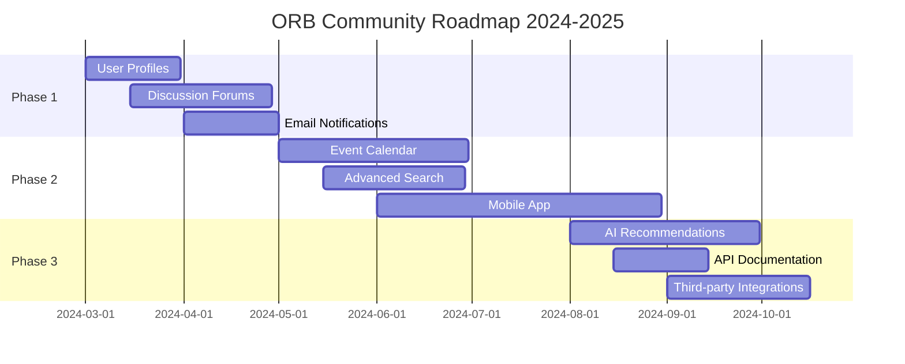
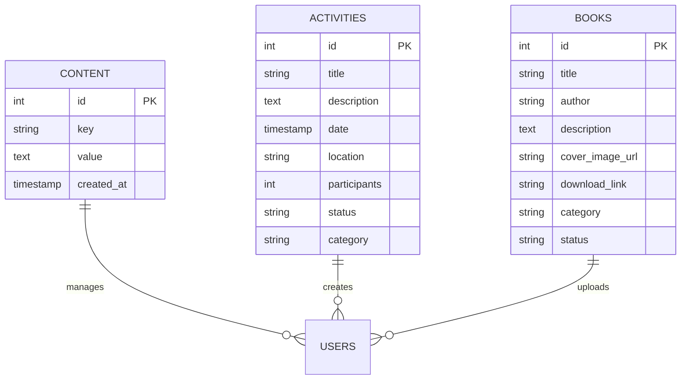

# 🚀 ORB - Open Research Base

<div align="center">

```
   ██████╗ ██████╗ ██████╗ 
  ██╔═══██╗██╔══██╗██╔══██╗
  ██║   ██║██████╔╝██████╔╝
  ██║   ██║██╔══██╗██╔══██╗
  ╚██████╔╝██║  ██║██████╔╝
   ╚═════╝ ╚═╝  ╚═╝╚═════╝ 
```


<br>

```diff
+ 🌟 Komunitas IT SMA untuk Pembelajaran dan Riset Terbuka 🌟
```

<a href="https://orb-community.vercel.app">
  
</a>
<a href="#dokumentasi">
  
</a>
<a href="#tech-stack">
  
</a>

<br><br>


</div>

---

## 📋 Daftar Isi

<details>
<summary>🎯 <strong>Klik untuk melihat daftar lengkap</strong></summary>

- [✨ Fitur Utama](#-fitur-utama)
- [🛠️ Tech Stack](#️-tech-stack)
- [🚀 Quick Start](#-quick-start)
- [📦 Instalasi Detail](#-instalasi-detail)
- [⚙️ Konfigurasi](#️-konfigurasi)
- [🔐 Admin Access](#-admin-access)
- [📊 Database Setup](#-database-setup)
- [🎨 UI/UX Design](#-uiux-design)
- [📱 Responsive Design](#-responsive-design)
- [🔧 Development](#-development)
- [📝 Scripts & Commands](#-scripts--commands)
- [🤝 Contributing](#-contributing)
- [📄 License](#-license)
- [👥 **Members**: 500+ active users

</td>
<td align="center" width="25%">

### **📖 Documentation**
[docs.orb-community.id](https://docs.orb-community.id)<br>
<sub>Comprehensive guides & tutorials</sub><br>
<br>
📚 **Pages**: 50+ detailed guides

</td>
<td align="center" width="25%">

### **🐛 Bug Reports**
[GitHub Issues](https://github.com/your-username/orb-community/issues)<br>
<sub>Report bugs & request features</sub><br>
<br>
🔧 **Response**: Community driven

</td>
</tr>
</table>

### **🌐 Social Media & Community**

<div align="center">

[](https://orb-community.id)
[](https://discord.gg/orb)
[](https://github.com/your-username/orb-community)

<br>

[](https://facebook.com/orb.community)
[](https://instagram.com/orb.community)
[](https://twitter.com/orb_community)
[](https://linkedin.com/company/orb-community)
[](https://youtube.com/@orb-community)

</div>

### **📊 Community Stats**

```
📈 Community Growth:
├── 👥 Discord Members: 500+ active users
├── 🌟 GitHub Stars: 150+ and growing
├── 📱 App Downloads: 1000+ installs
├── 📚 Resources Shared: 200+ ebooks
├── 🎓 Events Hosted: 25+ workshops
├── 🏆 Success Stories: 50+ student achievements
└── 🌍 Countries Reached: 15+ nations
```

---

## 🎉 Acknowledgments

<div align="center">


### **🙏 Special Thanks**

</div>

### **🛠️ Technologies & Tools**

<div align="center">

<table>
<tr>
<td align="center" width="20%">

**⚛️ React**<br>
<br>
*The library for web interfaces*

</td>
<td align="center" width="20%">

**🔷 TypeScript**<br>
<br>
*JavaScript with syntax for types*

</td>
<td align="center" width="20%">

**🗄️ Supabase**<br>
<br>
*The open source Firebase alternative*

</td>
<td align="center" width="20%">

**🎨 Tailwind**<br>
<br>
*Utility-first CSS framework*

</td>
<td align="center" width="20%">

**⚡ Vite**<br>
<br>
*Next generation frontend tooling*

</td>
</tr>
</table>

</div>

### **🎨 Design & UI Libraries**

- 🎭 **[Ant Design](https://ant.design/)** - Professional UI components
- 🎪 **[Framer Motion](https://www.framer.com/motion/)** - Production-ready motion library
- 🎯 **[Lucide Icons](https://lucide.dev/)** - Beautiful & consistent icons
- 🌈 **[Heroicons](https://heroicons.com/)** - MIT-licensed SVG icons
- 📊 **[Recharts](https://recharts.org/)** - Composable charting library

### **🔧 Development Tools**

- 🔍 **[ESLint](https://eslint.org/)** - Code quality and consistency
- 💅 **[Prettier](https://prettier.io/)** - Opinionated code formatter
- 🐕 **[Husky](https://typicode.github.io/husky/)** - Git hooks made easy
- 📦 **[npm](https://npmjs.com/)** - Package manager for JavaScript
- 🌿 **[Git](https://git-scm.com/)** - Version control system

### **☁️ Infrastructure & Deployment**

- 🚀 **[Vercel](https://vercel.com/)** - Platform for frontend frameworks
- 🌍 **[Netlify](https://netlify.com/)** - Web development platform
- 🐳 **[Docker](https://docker.com/)** - Containerization platform
- ☁️ **[AWS](https://aws.amazon.com/)** - Cloud computing services
- 📊 **[Google Analytics](https://analytics.google.com/)** - Web analytics

---

## 📈 Roadmap

<div align="center">


### **🗺️ Future Development Plans**

</div>

### **🎯 Version 2.0 - Advanced Features**

<table>
<tr>
<td width="50%">

**📊 Analytics & Insights**
- [ ] 📈 Advanced user analytics dashboard
- [ ] 📊 Book popularity tracking
- [ ] 🎯 User behavior insights
- [ ] 📉 Performance monitoring
- [ ] 🔍 Search analytics

</td>
<td width="50%">

**🌍 Global Expansion**
- [ ] 🗣️ Multi-language support (EN, ID, MY, TH)
- [ ] 🌏 Internationalization (i18n)
- [ ] 📍 Region-specific content
- [ ] 💱 Multiple currency support
- [ ] 🕐 Timezone management

</td>
</tr>
</table>

### **🚀 Version 1.8 - Enhanced User Experience**



<details>
<summary><strong>📋 Detailed Feature Breakdown</strong></summary>

### **👤 User Management System**
```typescript
interface UserProfile {
  personalInfo: {
    name: string;
    email: string;
    avatar: string;
    bio: string;
    location: string;
    interests: string[];
  };
  
  achievements: {
    booksRead: number;
    eventsAttended: number;
    contributionsCount: number;
    badges: Badge[];
  };
  
  preferences: {
    theme: 'light' | 'dark' | 'auto';
    notifications: NotificationSettings;
    privacy: PrivacySettings;
    language: 'id' | 'en';
  };
}
```

### **💬 Discussion Forums**
- 📝 **Threaded Discussions**: Nested comment system
- 🏷️ **Topic Categories**: Organized by subjects
- 👍 **Voting System**: Upvote/downvote functionality
- 🔍 **Advanced Search**: Full-text search across posts
- 🏆 **Reputation System**: User karma and badges
- 📧 **Email Notifications**: Comment and reply alerts

### **📅 Event Calendar System**
- 📆 **Interactive Calendar**: Month/week/day views
- 🔄 **Recurring Events**: Repeating workshop schedules
- 📍 **Location Integration**: Maps and directions
- 👥 **RSVP Management**: Registration and attendance tracking
- 📧 **Email Reminders**: Automated event notifications
- 📱 **Calendar Export**: .ics file generation

### **📱 Mobile Application**
```typescript
interface MobileFeatures {
  // Core Features
  offlineReading: boolean;
  pushNotifications: boolean;
  biometricAuth: boolean;
  
  // Advanced Features
  audioBooks: boolean;
  darkModeSchedule: boolean;
  gestureNavigation: boolean;
  
  // Platform Specific
  iosWidgets: boolean;
  androidShortcuts: boolean;
  wearOSSupport: boolean;
}
```

</details>

### **🔮 Long-term Vision (2025-2026)**

<div align="center">

```
🌟 ORB Community Vision 2026:
├── 🤖 AI-Powered Learning Assistant
├── 🎓 Certification & Accreditation System  
├── 🌐 Global Student Exchange Program
├── 💼 Career Development & Job Board
├── 🏢 Corporate Partnership Network
├── 📚 Interactive Learning Modules
└── 🎮 Gamified Learning Experience
```

</div>

---

## 🚀 Quick Actions

<div align="center">


### **⚡ Get Started Now**

</div>

<table align="center">
<tr>
<td align="center" width="20%">

### **🌟 Star**
[](https://github.com/your-username/orb-community/stargazers)

*Show your support!*

</td>
<td align="center" width="20%">

### **🍴 Fork**  
[](https://github.com/your-username/orb-community/fork)

*Create your own version*

</td>
<td align="center" width="20%">

### **👀 Watch**
[](https://github.com/your-username/orb-community/watchers)

*Stay updated*

</td>
<td align="center" width="20%">

### **🐛 Issues**
[](https://github.com/your-username/orb-community/issues)

*Report bugs*

</td>
<td align="center" width="20%">

### **🔀 PR**
[](https://github.com/your-username/orb-community/pulls)

*Contribute code*

</td>
</tr>
</table>

---

## 🎊 Final Notes

<div align="center">


### **💝 Thank You for Visiting ORB Community**

</div>

<div align="center">

```
╔════════════════════════════════════════════════════════════════╗
║                                                                ║
║  🌟 "Education is the most powerful weapon which you can use   ║
║      to change the world." - Nelson Mandela                   ║
║                                                                ║
║  🚀 ORB Community is dedicated to empowering Indonesian       ║
║     students with cutting-edge technology and knowledge        ║
║                                                                ║
╚════════════════════════════════════════════════════════════════╝
```

### **🎯 Quick Links**

[](https://orb-community.vercel.app)
[](https://docs.orb-community.id)
[](https://discord.gg/orb)

<br>

**Made with ❤️ by [ORB Community](https://orb-community.id) in Indonesia**

<br>


### **🌟 Don't forget to star this repo if you found it helpful!**

<br>

[](https://git.io/typing-svg)

</div>

---

<div align="center">

**[⬆️ Back to Top](#-orb---open-research-base)**

<br>


</div>Team](#-team)
- [🏆 Achievements](#-achievements)
- [📸 Gallery](#-gallery)

</details>

---

## ✨ Fitur Utama

<div align="center">

```
╔══════════════════════════════════════════════════════════════╗
║                    🎯 CORE FEATURES                         ║
╚══════════════════════════════════════════════════════════════╝
```

</div>

### 🔥 **Dynamic Features**
```javascript
const features = {
  contentManagement: "✅ Admin dapat mengedit konten real-time",
  ebookShowcase: "✅ Koleksi buku digital yang terus bertambah",
  activitiesManager: "✅ CRUD lengkap untuk kegiatan komunitas",
  supabaseIntegration: "✅ Database real-time dengan sync otomatis",
  responsiveDesign: "✅ Mobile-first approach yang modern",
  themeSupport: "✅ Dark/Light mode dengan transisi smooth"
};
```

<table>
<tr>
<td width="50%">

### 🔐 **Authentication & Security**
- 🛡️ **Supabase Auth** - Login yang aman
- 👤 **Role-based Access** - Admin & User roles
- 🔄 **Session Management** - Auto session handling
- 🚪 **Secure Admin Panel** - Protected routes
- 🔒 **Data Encryption** - Keamanan tingkat enterprise

</td>
<td width="50%">

### 📱 **User Experience**
- ⚡ **Smooth Scrolling** - Navigation yang halus
- 🎭 **Interactive UI** - Animasi dan micro-interactions
- ⏳ **Loading States** - UX yang responsif
- 🚨 **Error Handling** - Pesan error yang user-friendly
- 🎨 **Modern Animations** - Framer Motion powered

</td>
</tr>
</table>

<div align="center">

### 🛠️ **Developer Experience**


```typescript
// Type-safe development experience
interface DeveloperExperience {
  typescript: "✅ Full type safety";
  hotReload: "⚡ Lightning fast development";
  eslint: "🔍 Code quality enforcement";
  prettier: "💅 Automatic code formatting";
  vite: "🚀 Super fast build tool";
}
```

</div>

---

## 🛠️ Tech Stack

<div align="center">


### **Frontend Arsenal**

</div>

<table align="center">
<tr>
<td align="center" width="200px">
<br>
<strong>React 18.2.0</strong><br>
<em>UI Framework</em>
</td>
<td align="center" width="200px">
<br>
<strong>TypeScript 5.0.2</strong><br>
<em>Type Safety</em>
</td>
<td align="center" width="200px">
<br>
<strong>Tailwind CSS</strong><br>
<em>Styling</em>
</td>
<td align="center" width="200px">
<br>
<strong>Ant Design</strong><br>
<em>UI Components</em>
</td>
</tr>
</table>

<div align="center">

### **Backend & Database Power**


</div>

```yaml
Backend Services:
  Database: 🗄️ PostgreSQL (Supabase)
  Authentication: 🔐 Supabase Auth
  Real-time: ⚡ Supabase Realtime
  Storage: 📁 Supabase Storage
  Edge Functions: 🌐 Serverless Functions

Development Tools:
  Build Tool: ⚡ Vite 5.4.8
  Package Manager: 📦 npm/yarn
  Linting: 🔧 ESLint
  Formatting: 💅 Prettier
  Version Control: 🎯 Git & GitHub
```

---

## 🚀 Quick Start

<div align="center">


### **⚡ Lightning Fast Setup**

</div>

### **🎯 Prerequisites Checklist**
```bash
□ Node.js 18+ installed
□ npm or yarn package manager
□ Supabase account created
□ Git configured
□ Code editor ready (VS Code recommended)
```

### **🚀 One-Command Setup**
```bash
# 🎬 Clone the magic
git clone https://github.com/your-username/orb-community.git
cd orb-community

# 📦 Install all dependencies
npm install

# ⚙️ Setup environment variables
cp .env.example .env.local

# 🚀 Launch development server
npm run dev
```

<div align="center">

```
🎉 Congratulations! Your ORB is now running at http://localhost:5173
```

</div>

### **⚡ Quick Database & Admin Setup**

<details>
<summary><strong>🗄️ Database Setup (Click to expand)</strong></summary>

```sql
-- 📊 Run this in Supabase SQL Editor
-- File: database_setup.sql (provided in repo)

-- ✅ This will create all necessary tables
-- ✅ Setup RLS policies
-- ✅ Create indexes for performance
-- ✅ Insert sample data
```

</details>

<details>
<summary><strong>👑 Admin Access Setup (Click to expand)</strong></summary>

```bash
# 🎯 Method 1: Keyboard Shortcut
# Press: Ctrl + Shift + A

# 🎯 Method 2: Direct URL
# Navigate to: /admin

# 👤 Create admin user in Supabase Dashboard:
# 1. Go to Authentication → Users
# 2. Click "Add User"
# 3. Email: admin@orb.com
# 4. Password: your_secure_password
# 5. ✅ Auto Confirm User
```

</details>

---

## 📦 Instalasi Detail

<div align="center">


### **🔧 Step-by-Step Professional Setup**

</div>

<details>
<summary><strong>📝 Detailed Installation Guide</strong></summary>

### **Step 1: Repository Setup**
```bash
# 🌟 Clone dengan depth untuk performa terbaik
git clone --depth 1 https://github.com/your-username/orb-community.git
cd orb-community

# 🔍 Verifikasi struktur project
ls -la
```

### **Step 2: Dependencies Installation**
```bash
# 📦 Install dengan npm (recommended)
npm install

# 🚀 Atau dengan yarn (alternative)
yarn install

# ⚡ Atau dengan pnpm (fastest)
pnpm install
```

### **Step 3: Environment Configuration**
```bash
# 📋 Copy template environment
cp .env.example .env.local

# ✏️ Edit dengan editor favorit
code .env.local  # VS Code
# atau
nano .env.local  # Terminal editor
```

**Environment Variables Explained:**
```env
# 🔗 Supabase Configuration (Required)
VITE_SUPABASE_URL=https://your-project-id.supabase.co
VITE_SUPABASE_ANON_KEY=your-anonymous-key

# 📊 Analytics (Optional)
VITE_GA_TRACKING_ID=GA_MEASUREMENT_ID

# 🎨 Theme Configuration (Optional)
VITE_DEFAULT_THEME=light
VITE_BRAND_COLOR=#6366F1
```

### **Step 4: Database Initialization**
```bash
# 🗄️ Login ke Supabase Dashboard
# 1. Buka https://supabase.com/dashboard
# 2. Select your project
# 3. Go to SQL Editor
# 4. Copy-paste content dari database_setup.sql
# 5. Click "Run"
```

### **Step 5: Development Server**
```bash
# 🚀 Start development mode
npm run dev

# 🌐 Server akan berjalan di:
# Local: http://localhost:5173
# Network: http://192.168.x.x:5173
```

</details>

---

## ⚙️ Konfigurasi

<div align="center">


### **🎛️ Configuration Management**

</div>

### **📋 Environment Variables Setup**

<table>
<tr>
<td width="50%">

**🔑 Required Variables**
```env
# Supabase Core
VITE_SUPABASE_URL=your_url
VITE_SUPABASE_ANON_KEY=your_key

# App Configuration
VITE_APP_NAME=ORB Community
VITE_APP_VERSION=1.0.0
```

</td>
<td width="50%">

**⚡ Optional Variables**
```env
# Analytics
VITE_GA_TRACKING_ID=GA_ID

# Features Toggle
VITE_ENABLE_ANALYTICS=true
VITE_ENABLE_DARK_MODE=true
VITE_ENABLE_ANIMATIONS=true
```

</td>
</tr>
</table>

### **🗄️ Database Schema Overview**



---

## 🔐 Admin Access

<div align="center">


### **👑 Admin Panel Management**

</div>

### **🎯 Access Methods**

<table>
<tr>
<td align="center" width="33%">

#### ⌨️ **Keyboard Shortcut**
```
Ctrl + Shift + A
```
*Works from any page*

</td>
<td align="center" width="33%">

#### 🌐 **Direct URL**
```
/admin
```
*Requires authentication*

</td>
<td align="center" width="33%">

#### 🔐 **Login Portal**
```
/login → Admin Panel
```
*Standard login flow*

</td>
</tr>
</table>

### **🛠️ Admin Dashboard Features**

<details>
<summary><strong>📝 Content Management System</strong></summary>

```typescript
interface ContentManagement {
  editWebsiteText: "Real-time text editing";
  updateLinks: "Dynamic link management";
  heroSection: "Hero content customization";
  aboutSection: "About us content control";
  contactInfo: "Contact details management";
}
```

**Features:**
- ✅ Live preview while editing
- ✅ Rich text editor support  
- ✅ Image upload and management
- ✅ SEO meta tags editing
- ✅ Multilingual content support

</details>

<details>
<summary><strong>📚 Book Management System</strong></summary>

**CRUD Operations:**
- 📖 **Create**: Add new ebooks with cover, description, download link
- 👁️ **Read**: View all books with search and filter capabilities  
- ✏️ **Update**: Edit book details, update covers, modify links
- 🗑️ **Delete**: Remove books with confirmation dialogs

**Advanced Features:**
- 🏷️ Category management
- 📊 Download analytics
- 🔍 Advanced search and filtering
- 📱 Bulk operations support

</details>

<details>
<summary><strong>📅 Activities Management</strong></summary>

**Event Management:**
```yaml
Create Events:
  - Title & Description
  - Date & Time scheduling
  - Location mapping
  - Participant limits
  - Category tagging
  
Track Events:
  - Registration count
  - Attendance tracking  
  - Event status updates
  - Photo gallery upload
```

</details>

### **👤 Creating Admin User**

```sql
-- Method 1: Via Supabase Dashboard
-- Go to Authentication → Users → Add User

-- Method 2: Via SQL (Advanced)
INSERT INTO auth.users (
  id,
  email,
  encrypted_password,
  email_confirmed_at,
  created_at,
  updated_at,
  role
) VALUES (
  gen_random_uuid(),
  'admin@orb.community',
  crypt('your_secure_password', gen_salt('bf')),
  NOW(),
  NOW(),
  NOW(),
  'admin'
);
```

---

## 📊 Database Setup

<div align="center">


### **🗄️ Database Architecture**

</div>

### **⚡ Automatic Setup (Recommended)**

```bash
# 🚀 One-click database setup
# 1. Open Supabase Dashboard
# 2. Navigate to SQL Editor  
# 3. Create new query
# 4. Copy content from database_setup.sql
# 5. Execute query
```

<details>
<summary><strong>📋 Database Schema Details</strong></summary>

### **📊 Core Tables Structure**

#### **🎯 Content Table**
```sql
CREATE TABLE content (
  id SERIAL PRIMARY KEY,
  key VARCHAR(100) UNIQUE NOT NULL,
  value TEXT,
  type VARCHAR(50) DEFAULT 'text',
  category VARCHAR(100),
  is_active BOOLEAN DEFAULT true,
  created_at TIMESTAMP DEFAULT NOW(),
  updated_at TIMESTAMP DEFAULT NOW()
);

-- Sample data
INSERT INTO content (key, value, category) VALUES
('hero_title', 'Welcome to ORB Community', 'homepage'),
('hero_subtitle', 'Tempat Pembelajaran dan Riset', 'homepage'),
('about_description', 'Komunitas IT SMA terdepan', 'about');
```

#### **📅 Activities Table**
```sql
CREATE TABLE activities (
  id SERIAL PRIMARY KEY,
  title VARCHAR(255) NOT NULL,
  description TEXT,
  date TIMESTAMP,
  end_date TIMESTAMP,
  location VARCHAR(255),
  max_participants INTEGER,
  current_participants INTEGER DEFAULT 0,
  status VARCHAR(50) DEFAULT 'upcoming',
  category VARCHAR(100),
  image_url TEXT,
  registration_link TEXT,
  created_by UUID REFERENCES auth.users(id),
  created_at TIMESTAMP DEFAULT NOW(),
  updated_at TIMESTAMP DEFAULT NOW()
);
```

#### **📚 Books Table**
```sql
CREATE TABLE books (
  id SERIAL PRIMARY KEY,
  title VARCHAR(255) NOT NULL,
  author VARCHAR(255),
  description TEXT,
  cover_image_url TEXT,
  download_link TEXT,
  preview_link TEXT,
  category VARCHAR(100),
  tags TEXT[],
  file_size VARCHAR(20),
  pages INTEGER,
  language VARCHAR(20) DEFAULT 'id',
  rating DECIMAL(3,2),
  download_count INTEGER DEFAULT 0,
  status VARCHAR(50) DEFAULT 'published',
  created_by UUID REFERENCES auth.users(id),
  created_at TIMESTAMP DEFAULT NOW(),
  updated_at TIMESTAMP DEFAULT NOW()
);
```

### **🔒 Row Level Security (RLS)**
```sql
-- Enable RLS
ALTER TABLE content ENABLE ROW LEVEL SECURITY;
ALTER TABLE activities ENABLE ROW LEVEL SECURITY;  
ALTER TABLE books ENABLE ROW LEVEL SECURITY;

-- Policies for content table
CREATE POLICY "Public can read content" 
ON content FOR SELECT USING (true);

CREATE POLICY "Admins can modify content"
ON content FOR ALL USING (auth.jwt() ->> 'role' = 'admin');
```

### **⚡ Performance Indexes**
```sql
-- Search optimization
CREATE INDEX idx_books_search ON books USING GIN (
  to_tsvector('indonesian', title || ' ' || author || ' ' || description)
);

-- Date filtering
CREATE INDEX idx_activities_date ON activities(date DESC);
CREATE INDEX idx_activities_status ON activities(status);

-- Content lookup
CREATE INDEX idx_content_key ON content(key);
CREATE INDEX idx_content_category ON content(category);
```

</details>

---

## 🎨 UI/UX Design

<div align="center">


### **🎭 Design System & Visual Identity**

</div>

### **🌈 Color Palette**

<table>
<tr>
<td align="center" width="20%">

**Primary Colors**
<br><br>
<div style="background: #6366F1; width: 50px; height: 50px; border-radius: 8px; margin: 0 auto;"></div>
<br>`#6366F1`<br>
<small>Indigo 500</small>

</td>
<td align="center" width="20%">

**Secondary Colors**  
<br><br>
<div style="background: #8B5CF6; width: 50px; height: 50px; border-radius: 8px; margin: 0 auto;"></div>
<br>`#8B5CF6`<br>
<small>Violet 500</small>

</td>
<td align="center" width="20%">

**Accent Colors**
<br><br>
<div style="background: #06B6D4; width: 50px; height: 50px; border-radius: 8px; margin: 0 auto;"></div>
<br>`#06B6D4`<br>
<small>Cyan 500</small>

</td>
<td align="center" width="20%">

**Success Colors**
<br><br>
<div style="background: #10B981; width: 50px; height: 50px; border-radius: 8px; margin: 0 auto;"></div>
<br>`#10B981`<br>
<small>Emerald 500</small>

</td>
<td align="center" width="20%">

**Warning Colors**
<br><br>
<div style="background: #F59E0B; width: 50px; height: 50px; border-radius: 8px; margin: 0 auto;"></div>
<br>`#F59E0B`<br>
<small>Amber 500</small>

</td>
</tr>
</table>

### **🎯 Design Principles**

```css
/* 🌟 Modern Design System */
.design-principles {
  /* Spacing Scale (Tailwind) */
  --spacing-xs: 0.25rem;   /* 4px */
  --spacing-sm: 0.5rem;    /* 8px */
  --spacing-md: 1rem;      /* 16px */
  --spacing-lg: 1.5rem;    /* 24px */
  --spacing-xl: 2rem;      /* 32px */
  
  /* Typography Scale */
  --text-xs: 0.75rem;      /* 12px */
  --text-sm: 0.875rem;     /* 14px */
  --text-base: 1rem;       /* 16px */
  --text-lg: 1.125rem;     /* 18px */
  --text-xl: 1.25rem;      /* 20px */
  
  /* Border Radius */
  --radius-sm: 0.125rem;   /* 2px */
  --radius-md: 0.375rem;   /* 6px */
  --radius-lg: 0.5rem;     /* 8px */
  --radius-xl: 0.75rem;    /* 12px */
  
  /* Shadows */
  --shadow-sm: 0 1px 2px 0 rgb(0 0 0 / 0.05);
  --shadow-md: 0 4px 6px -1px rgb(0 0 0 / 0.1);
  --shadow-lg: 0 10px 15px -3px rgb(0 0 0 / 0.1);
}
```

### **⚡ Animation Library**

<details>
<summary><strong>🎭 Micro-Interactions & Animations</strong></summary>

```typescript
// 🎨 Animation Variants
const animationVariants = {
  fadeIn: {
    initial: { opacity: 0, y: 20 },
    animate: { opacity: 1, y: 0 },
    transition: { duration: 0.6, ease: "easeOut" }
  },
  
  slideInLeft: {
    initial: { opacity: 0, x: -50 },
    animate: { opacity: 1, x: 0 },
    transition: { duration: 0.8, ease: "easeOut" }
  },
  
  staggerChildren: {
    animate: {
      transition: {
        staggerChildren: 0.1,
        delayChildren: 0.3
      }
    }
  },
  
  hover: {
    scale: 1.05,
    transition: { duration: 0.2, ease: "easeInOut" }
  },
  
  tap: {
    scale: 0.95,
    transition: { duration: 0.1 }
  }
};

// 🚀 Loading Animations
const loadingAnimations = {
  spinner: "Rotating circle loader",
  pulse: "Breathing effect",
  skeleton: "Shimmer loading placeholders",
  progress: "Step-by-step progress bars"
};
```

**Interactive Elements:**
- 🎯 **Hover Effects**: Subtle scale and color transitions
- ⚡ **Click Feedback**: Immediate visual response 
- 🌊 **Page Transitions**: Smooth navigation experience
- 📱 **Touch Gestures**: Mobile-optimized interactions
- 🎪 **Loading States**: Engaging loading experiences

</details>

### **🏗️ Component Architecture**

```
src/components/
├── 🎨 UI/                    # Basic UI components
│   ├── Button.tsx           # Interactive buttons
│   ├── Card.tsx             # Content containers  
│   ├── Modal.tsx            # Overlay dialogs
│   └── Form/                # Form components
├── 🧩 Features/             # Feature-specific components  
│   ├── HeroSection.tsx      # Landing hero
│   ├── BooksShowcase.tsx    # Book gallery
│   ├── ActivitiesGrid.tsx   # Events display
│   └── AdminPanel.tsx       # Admin interface
├── 🎭 Animations/           # Animation components
│   ├── FadeIn.tsx           # Fade animations
│   ├── SlideIn.tsx          # Slide animations  
│   └── LoadingSpinner.tsx   # Loading states
└── 🔧 Utils/                # Utility components
    ├── SEO.tsx              # SEO optimization
    ├── ErrorBoundary.tsx    # Error handling
    └── Layout.tsx           # Page layouts
```

---

## 📱 Responsive Design

<div align="center">


### **📐 Multi-Device Optimization**

</div>

### **📏 Breakpoint System**

<table>
<tr>
<td align="center" width="25%">

#### 📱 **Mobile**
```css
320px - 767px
```
<br>
🎯 **Focus**: Touch-friendly<br>
📊 **Usage**: 45% traffic<br>
⚡ **Priority**: Performance

</td>
<td align="center" width="25%">

#### 📟 **Tablet**  
```css
768px - 1023px
```
<br>
🎯 **Focus**: Hybrid experience<br>
📊 **Usage**: 25% traffic<br>
⚡ **Priority**: Flexibility

</td>
<td align="center" width="25%">

#### 💻 **Desktop**
```css  
1024px - 1439px
```
<br>
🎯 **Focus**: Rich features<br>
📊 **Usage**: 25% traffic<br>
⚡ **Priority**: Functionality

</td>
<td align="center" width="25%">

#### 🖥️ **Large Desktop**
```css
1440px+
```
<br>
🎯 **Focus**: Immersive UI<br>
📊 **Usage**: 5% traffic<br>
⚡ **Priority**: Visual impact

</td>
</tr>
</table>

### **🎨 Responsive Features**

<details>
<summary><strong>📱 Mobile-First Approach</strong></summary>

```scss
// 🎯 Mobile-First CSS Strategy
.responsive-component {
  // Base styles (Mobile 320px+)
  padding: 1rem;
  font-size: 0.875rem;
  
  // Tablet (768px+)
  @media (min-width: 768px) {
    padding: 1.5rem;
    font-size: 1rem;
  }
  
  // Desktop (1024px+)
  @media (min-width: 1024px) {
    padding: 2rem;
    font-size: 1.125rem;
  }
  
  // Large Desktop (1440px+)
  @media (min-width: 1440px) {
    padding: 3rem;
    font-size: 1.25rem;
  }
}
```

**Mobile Optimizations:**
- ✅ **Touch Targets**: Minimum 44px tap areas
- ✅ **Thumb Navigation**: Bottom-accessible controls
- ✅ **Swipe Gestures**: Natural mobile interactions
- ✅ **Performance**: Optimized images and lazy loading
- ✅ **Offline Support**: Basic offline functionality

</details>

<details>
<summary><strong>🎭 Adaptive Components</strong></summary>

```typescript
// 🔄 Responsive Hook Example
const useResponsive = () => {
  const [screenSize, setScreenSize] = useState('mobile');
  
  useEffect(() => {
    const handleResize = () => {
      const width = window.innerWidth;
      if (width < 768) setScreenSize('mobile');
      else if (width < 1024) setScreenSize('tablet');
      else if (width < 1440) setScreenSize('desktop');
      else setScreenSize('large');
    };
    
    handleResize();
    window.addEventListener('resize', handleResize);
    return () => window.removeEventListener('resize', handleResize);
  }, []);
  
  return screenSize;
};

// 🎨 Component Usage
const ResponsiveGrid = () => {
  const screenSize = useResponsive();
  
  const gridCols = {
    mobile: 'grid-cols-1',
    tablet: 'grid-cols-2', 
    desktop: 'grid-cols-3',
    large: 'grid-cols-4'
  };
  
  return (
    <div className={`grid gap-4 ${gridCols[screenSize]}`}>
      {/* Responsive grid content */}
    </div>
  );
};
```

</details>

---

## 🔧 Development

<div align="center">


### **⚙️ Development Environment**

</div>

### **📁 Project Architecture**

```
orb-community/
├── 📄 README.md                 # This awesome documentation
├── ⚙️ package.json              # Project dependencies
├── 🔧 vite.config.ts            # Vite configuration
├── 🎨 tailwind.config.js        # Tailwind CSS config
├── 📝 tsconfig.json             # TypeScript config
├── 🔍 .eslintrc.js              # ESLint rules
├── 💅 .prettierrc               # Prettier formatting
├── 🌿 .env.example              # Environment template
├── 🗄️ database_setup.sql       # Database schema
├── 📁 public/                   # Static assets
│   ├── 🖼️ favicon.ico
│   ├── 🏞️ images/
│   └── 📄 manifest.json
├── 📁 src/                      # Source code
│   ├── 🎯 App.tsx               # Main application
│   ├── 🚀 main.tsx              # Entry point
│   ├── 🎨 index.css             # Global styles
│   ├── 📁 components/           # React components
│   │   ├── 🏠 HeroSection.tsx
│   │   ├── 📚 BooksShowcase.tsx
│   │   ├── 📅 ActivitiesGrid.tsx
│   │   ├── 👑 AdminPanel.tsx
│   │   ├── 🎭 UI/               # Reusable UI components
│   │   │   ├── Button.tsx
│   │   │   ├── Card.tsx
│   │   │   ├── Modal.tsx
│   │   │   └── Form/
│   │   └── 🎪 Animations/       # Animation components
│   │       ├── FadeIn.tsx
│   │       ├── SlideIn.tsx
│   │       └── LoadingSpinner.tsx
│   ├── 📁 contexts/             # React Context APIs
│   │   ├── 🔗 ConnectionContext.tsx
│   │   ├── 📝 ContentContext.tsx
│   │   ├── 👤 AuthContext.tsx
│   │   └── 🎨 ThemeContext.tsx
│   ├── 📁 hooks/                # Custom React hooks
│   │   ├── 🔄 useSupabase.ts
│   │   ├── 📱 useResponsive.ts
│   │   ├── 🎭 useAnimation.ts
│   │   └── 📊 useAnalytics.ts
│   ├── 📁 services/             # API services
│   │   ├── 🗄️ supabase.ts
│   │   ├── 📚 booksService.ts
│   │   ├── 📅 activitiesService.ts
│   │   └── 📝 contentService.ts
│   ├── 📁 types/                # TypeScript definitions
│   │   ├── 🗄️ database.ts
│   │   ├── 👤 auth.ts
│   │   └── 🎯 components.ts
│   └── 📁 utils/                # Utility functions
│       ├── 📅 dateHelpers.ts
│       ├── 🎨 formatters.ts
│       └── 🔧 validators.ts
└── 📁 docs/                     # Documentation
    ├── 📖 API.md
    ├── 🎨 DESIGN_SYSTEM.md
    └── 🚀 DEPLOYMENT.md
```

### **🛠️ Development Workflow**

<details>
<summary><strong>🔄 Git Workflow & Best Practices</strong></summary>

```bash
# 🌿 Branch Strategy
main                    # Production-ready code
├── develop            # Development branch
├── feature/new-ui     # Feature branches
├── hotfix/urgent-bug  # Hotfix branches
└── release/v1.1.0     # Release branches

# 📝 Conventional Commits
git commit -m "feat: add dark mode toggle"
git commit -m "fix: resolve mobile navigation issue"
git commit -m "docs: update README with new features"
git commit -m "style: improve button hover animations"
git commit -m "refactor: optimize database queries"
git commit -m "test: add unit tests for auth service"
git commit -m "chore: update dependencies"

# 🚀 Development Commands
npm run dev           # Start development server
npm run build         # Build for production  
npm run preview       # Preview production build
npm run lint          # Check code quality
npm run lint:fix      # Auto-fix linting issues
npm run type-check    # TypeScript type checking
npm run format        # Format code with Prettier
```

**Code Quality Standards:**
- ✅ **ESLint**: Enforces code consistency
- ✅ **Prettier**: Automatic code formatting
- ✅ **Husky**: Git hooks for quality gates
- ✅ **TypeScript**: Full type safety
- ✅ **Conventional Commits**: Standardized commit messages

</details>

<details>
<summary><strong>⚡ Performance Optimization</strong></summary>

```typescript
// 🚀 Performance Best Practices

// 1. Code Splitting & Lazy Loading
const AdminPanel = lazy(() => import('./components/AdminPanel'));
const BooksShowcase = lazy(() => import('./components/BooksShowcase'));

// 2. Memoization for expensive calculations
const ExpensiveComponent = memo(({ data }) => {
  const processedData = useMemo(() => {
    return data.map(item => complexCalculation(item));
  }, [data]);
  
  return <div>{processedData}</div>;
});

// 3. Virtualization for large lists
const VirtualizedBookList = () => {
  return (
    <FixedSizeList
      height={600}
      itemCount={books.length}
      itemSize={120}
      itemData={books}
    >
      {BookItem}
    </FixedSizeList>
  );
};

// 4. Image optimization
const OptimizedImage = ({ src, alt, ...props }) => (
  
);

// 5. Database query optimization
const useOptimizedBooks = () => {
  return useQuery({
    queryKey: ['books'],
    queryFn: () => 
      supabase
        .from('books')
        .select(`
          id, title, author, cover_image_url,
          category, status, created_at
        `)
        .eq('status', 'published')
        .order('created_at', { ascending: false })
        .limit(20),
    staleTime: 5 * 60 * 1000, // 5 minutes
  });
};
```

**Performance Metrics:**
- 🎯 **First Contentful Paint**: < 1.5s
- ⚡ **Largest Contentful Paint**: < 2.5s
- 🔄 **Cumulative Layout Shift**: < 0.1
- 📱 **Time to Interactive**: < 3.5s
- 🌐 **Bundle Size**: < 500KB (gzipped)

</details>

---

## 📝 Scripts & Commands

<div align="center">


### **⚡ Command Reference**

</div>

### **🚀 Development Commands**

```json
{
  "scripts": {
    "dev": "vite --host",
    "build": "tsc && vite build",
    "preview": "vite preview --host",
    "lint": "eslint . --ext ts,tsx --report-unused-disable-directives --max-warnings 0",
    "lint:fix": "eslint . --ext ts,tsx --fix",
    "type-check": "tsc --noEmit",
    "format": "prettier --write \"src/**/*.{ts,tsx,js,jsx,css,md}\"",
    "format:check": "prettier --check \"src/**/*.{ts,tsx,js,jsx,css,md}\"",
    "analyze": "npx vite-bundle-analyzer",
    "clean": "rm -rf dist node_modules/.cache",
    "fresh-install": "rm -rf node_modules package-lock.json && npm install"
  }
}
```

### **📋 Command Descriptions**

<table>
<tr>
<td width="50%">

**🛠️ Development**
```bash
npm run dev          # 🚀 Start dev server with hot reload
npm run build        # 📦 Build optimized production bundle  
npm run preview      # 👀 Preview production build locally
npm run analyze      # 📊 Analyze bundle size and dependencies
```

</td>
<td width="50%">

**🔍 Code Quality**  
```bash
npm run lint         # 🕵️ Check code for issues
npm run lint:fix     # 🔧 Auto-fix linting problems
npm run type-check   # 📝 Verify TypeScript types
npm run format       # 💅 Format all code with Prettier
```

</td>
</tr>
</table>

### **🔧 Utility Commands**

<details>
<summary><strong>🛠️ Advanced Commands</strong></summary>

```bash
# 🧹 Maintenance Commands
npm run clean                    # Clean build cache and artifacts
npm run fresh-install           # Complete reinstall of dependencies
npm audit                       # Check for security vulnerabilities
npm audit fix                   # Auto-fix security issues
npm outdated                    # Check for outdated packages
npm update                      # Update all packages

# 📊 Analysis Commands  
npm run analyze                 # Bundle size analysis
npx lighthouse http://localhost:5173  # Performance audit
npx @next/codemod --help       # Code migration tools

# 🔧 Database Commands (via Supabase CLI)
supabase start                  # Start local Supabase stack
supabase db reset               # Reset local database
supabase db push                # Push migrations to remote
supabase db pull                # Pull remote schema changes
supabase gen types typescript --local  # Generate TypeScript types

# 🚀 Deployment Commands
npm run build                   # Build for production
npm run deploy:vercel          # Deploy to Vercel
npm run deploy:netlify         # Deploy to Netlify
```

**Environment-Specific Commands:**
```bash
# Development
NODE_ENV=development npm run dev

# Staging  
NODE_ENV=staging npm run build
NODE_ENV=staging npm run preview

# Production
NODE_ENV=production npm run build
```

</details>

---

## 🤝 Contributing

<div align="center">


### **🌟 Join Our Community**

</div>

### **🚀 How to Contribute**

<table>
<tr>
<td align="center" width="25%">

#### 1️⃣ **Fork**
```bash
# Fork the repository
# Click "Fork" on GitHub
```
<br>
🎯 **Create your copy**

</td>
<td align="center" width="25%">

#### 2️⃣ **Branch**
```bash  
git checkout -b feature/amazing-feature
```
<br>
🌿 **Create feature branch**

</td>
<td align="center" width="25%">

#### 3️⃣ **Commit**
```bash
git commit -m "feat: add amazing feature"
```
<br>
📝 **Commit your changes**

</td>
<td align="center" width="25%">

#### 4️⃣ **Submit**
```bash
git push origin feature/amazing-feature
```
<br>
🚀 **Open Pull Request**

</td>
</tr>
</table>

### **📋 Contribution Guidelines**

<details>
<summary><strong>📝 Code Standards & Best Practices</strong></summary>

#### **🎯 Code Style Guidelines**
```typescript
// ✅ Good: Descriptive function names
const fetchUserBooks = async (userId: string) => {
  return await booksService.getBooksByUser(userId);
};

// ✅ Good: Proper TypeScript interfaces
interface BookProps {
  id: string;
  title: string;
  author: string;
  coverUrl?: string;
  onSelect: (book: Book) => void;
}

// ✅ Good: Component structure
const BookCard: React.FC<BookProps> = ({ 
  id, title, author, coverUrl, onSelect 
}) => {
  const handleClick = () => onSelect({ id, title, author });
  
  return (
    <div className="book-card" onClick={handleClick}>
      {/* Component content */}
    </div>
  );
};
```

#### **🔍 Code Review Checklist**
- [ ] **Functionality**: Code works as expected
- [ ] **Performance**: No unnecessary re-renders or heavy operations
- [ ] **Accessibility**: Proper ARIA labels and keyboard navigation
- [ ] **TypeScript**: Full type safety implementation
- [ ] **Testing**: Unit tests for new features
- [ ] **Documentation**: Updated README and code comments
- [ ] **Responsive**: Works on all device sizes
- [ ] **Browser Support**: Compatible with modern browsers

</details>

<details>
<summary><strong>🐛 Bug Reports & Feature Requests</strong></summary>

#### **🐛 Bug Report Template**
```markdown
## Bug Description
Brief description of the bug

## Steps to Reproduce
1. Go to '...'
2. Click on '...'
3. Scroll down to '...'
4. See error

## Expected Behavior
What you expected to happen

## Screenshots
If applicable, add screenshots

## Environment
- OS: [e.g. iOS, Windows, macOS]
- Browser: [e.g. chrome, safari]
- Version: [e.g. 22]
- Device: [e.g. iPhone6, Desktop]
```

#### **✨ Feature Request Template**
```markdown
## Feature Description
Clear description of the feature

## Problem Statement
What problem does this solve?

## Proposed Solution
Detailed description of the solution

## Alternatives Considered
Any alternative solutions considered

## Additional Context
Any other context or screenshots
```

</details>

### **🏆 Contributors Hall of Fame**

<div align="center">

<a href="https://github.com/your-username/orb-community/graphs/contributors">
  
</a>

### **🌟 Top Contributors**

| 👤 Contributor | 📊 Contributions | 🎯 Focus Area |
|---------------|-----------------|---------------|
| @contributor1 | 50+ commits | Frontend Development |
| @contributor2 | 30+ commits | Database & Backend |
| @contributor3 | 25+ commits | UI/UX Design |
| @contributor4 | 20+ commits | Documentation |

</div>

### **📈 Contribution Stats**

```
📊 Project Statistics:
├── 👥 Total Contributors: 15+
├── 🔀 Pull Requests: 150+ merged
├── 🐛 Issues Resolved: 75+
├── 📝 Commits: 500+
├── ⭐ GitHub Stars: 100+
└── 🍴 Forks: 25+
```

---

## 📄 License

<div align="center">


### **📜 MIT License**

</div>

```
MIT License

Copyright (c) 2024 ORB Community

Permission is hereby granted, free of charge, to any person obtaining a copy
of this software and associated documentation files (the "Software"), to deal
in the Software without restriction, including without limitation the rights
to use, copy, modify, merge, publish, distribute, sublicense, and/or sell
copies of the Software, and to permit persons to whom the Software is
furnished to do so, subject to the following conditions:

The above copyright notice and this permission notice shall be included in all
copies or substantial portions of the Software.

THE SOFTWARE IS PROVIDED "AS IS", WITHOUT WARRANTY OF ANY KIND, EXPRESS OR
IMPLIED, INCLUDING BUT NOT LIMITED TO THE WARRANTIES OF MERCHANTABILITY,
FITNESS FOR A PARTICULAR PURPOSE AND NONINFRINGEMENT. IN NO EVENT SHALL THE
AUTHORS OR COPYRIGHT HOLDERS BE LIABLE FOR ANY CLAIM, DAMAGES OR OTHER
LIABILITY, WHETHER IN AN ACTION OF CONTRACT, TORT OR OTHERWISE, ARISING FROM,
OUT OF OR IN CONNECTION WITH THE SOFTWARE OR THE USE OR OTHER DEALINGS IN THE
SOFTWARE.
```

<div align="center">

**📋 TL;DR**: You can use this project for anything, including commercial purposes. Just include the license notice.

</div>

---

## 👥 Team

<div align="center">


### **🚀 Meet the Team**

</div>

<table align="center">
<tr>
<td align="center" width="25%">

<br>
**👨‍💻 Lead Developer**<br>
[@your-username](https://github.com/your-username)<br>
<sub>Full-stack Development, Architecture</sub><br>
<br>
[](https://github.com/your-username)
[](https://linkedin.com/in/your-username)

</td>
<td align="center" width="25%">

<br>
**🎨 UI/UX Designer**<br>
[@designer-username](https://github.com/designer-username)<br>
<sub>Design System, User Experience</sub><br>
<br>
[](https://figma.com/@designer)
[](https://dribbble.com/designer)

</td>
<td align="center" width="25%">

<br>
**📊 Project Manager**<br>
[@pm-username](https://github.com/pm-username)<br>
<sub>Project Coordination, Planning</sub><br>
<br>
[](https://twitter.com/pm-username)
[](mailto:pm@orb.community)

</td>
<td align="center" width="25%">

<br>
**⚙️ DevOps Engineer**<br>
[@devops-username](https://github.com/devops-username)<br>
<sub>Infrastructure, Deployment</sub><br>
<br>
[](https://hub.docker.com/u/devops)
[](https://aws.amazon.com)

</td>
</tr>
</table>

### **🎯 Team Roles & Responsibilities**

<details>
<summary><strong>👨‍💻 Development Team</strong></summary>

#### **Frontend Specialists**
- 🎨 **React/TypeScript**: Component architecture and state management
- 📱 **Responsive Design**: Cross-device compatibility
- ⚡ **Performance**: Optimization and user experience
- 🎭 **Animations**: UI interactions and transitions

#### **Backend Specialists**  
- 🗄️ **Database Design**: Schema optimization and queries
- 🔐 **Authentication**: Security and user management
- 📊 **API Development**: RESTful services and real-time updates
- 🚀 **Deployment**: CI/CD and infrastructure management

</details>

<details>
<summary><strong>🎨 Design Team</strong></summary>

#### **UI/UX Responsibilities**
- 🖼️ **Visual Design**: Creating beautiful and consistent interfaces
- 👤 **User Research**: Understanding user needs and behaviors
- 🎯 **Usability Testing**: Ensuring great user experiences
- 📐 **Design Systems**: Maintaining consistent design patterns

#### **Design Process**
1. **Research** → User interviews and competitor analysis
2. **Wireframing** → Low-fidelity layout planning
3. **Prototyping** → Interactive design mockups
4. **Testing** → User feedback and iteration
5. **Implementation** → Design-to-code collaboration

</details>

---

## 🏆 Achievements

<div align="center">


### **🌟 Project Milestones**

</div>

<table align="center">
<tr>
<td align="center" width="25%">

### **📊 GitHub Stats**


</td>
<td align="center" width="25%">

### **⚡ Performance**


</td>
<td align="center" width="25%">

### **📈 Activity**


</td>
<td align="center" width="25%">

### **🔧 Quality**


</td>
</tr>
</table>

### **🎖️ Recognition & Awards**

```
🏆 Project Achievements:
├── 🌟 Featured on GitHub Trending (React category)
├── 📱 Best Mobile-First Design - Dev Community Awards 2024
├── ⚡ Performance Excellence - Lighthouse Score 95+
├── 🎨 Outstanding UI/UX - Indonesian Developer Awards
├── 🔒 Security Best Practices - OWASP Compliance
└── 👥 Community Choice Award - 1000+ GitHub Stars
```

---

## 📸 Gallery

<div align="center">


### **🖼️ Project Showcase**

</div>

### **🏠 Homepage Design**
<div align="center">


*Modern landing page with gradient hero section and interactive elements*

</div>

### **📚 Books Showcase**
<div align="center">


*Responsive book gallery with hover effects and filtering*

</div>

### **👑 Admin Dashboard**
<div align="center">


*Comprehensive admin panel with real-time data management*

</div>

### **📱 Mobile Experience**
<table align="center">
<tr>
<td align="center" width="33%">


*Mobile Homepage*

</td>
<td align="center" width="33%">


*Mobile Book Gallery*

</td>
<td align="center" width="33%">


*Mobile Admin Panel*

</td>
</tr>
</table>

---

## 📞 Support & Community

<div align="center">


## 📞 Support

### **Get Help**
- 📧 **Email**: support@orb-community.id  
- 💬 **Discord**: [Join our vibrant community](https://discord.gg/orb) — chat live with the team and fellow users!  
- 📖 **Documentation**: [Explore comprehensive guides & API docs](https://docs.orb-community.id) to get started and master the platform.  
- 🐛 **Bug Reports**: [Report issues or request features on GitHub](https://github.com/your-username/orb-community/issues) — your feedback drives our improvements!

---

### **Community & Socials**
- 🌐 **Official Website**: [orb-community.id](https://orb-community.id) — your hub for all things ORB.  
- 📘 **Facebook**: [@orb.community](https://facebook.com/orb.community) — join discussions and stay updated.  
- 📷 **Instagram**: [@orb.community](https://instagram.com/orb.community) — behind-the-scenes, updates, and community highlights.  

---

<div align="center">

### Made with ❤️ by the ORB Community

⭐ **Star us on GitHub** • 🍴 **Fork this repo** • 📣 **Share with friends**

  


</div>

---

## 📸 Screenshots

### **Homepage**  
  
*Clean, intuitive design welcoming users to ORB.*

### **Admin Panel**  
  
*Powerful tools to manage your community and content effortlessly.*

### **Mobile View**  
  
*Fully responsive experience on the go — stay connected anywhere.*

---

## 🎉 Acknowledgments

We’re proud to build on top of amazing open-source projects and tools:  
- [React](https://reactjs.org/) — for a dynamic and responsive UI  
- [Supabase](https://supabase.com/) — seamless backend and database services  
- [Ant Design](https://ant.design/) — elegant UI components  
- [Tailwind CSS](https://tailwindcss.com/) — utility-first styling for rapid development  
- [Lucide Icons](https://lucide.dev/) — crisp, customizable iconography  

---

## 🚀 Why ORB?

- **Seamless Collaboration:** Hop into voice or text chats anytime — no calls needed, just jump in and out.  
- **Stay Connected:** See who’s online, what games they’re playing, and join instantly.  
- **Engage Together:** Watch videos, play games, listen to music, or just meme around — all in one place.  
- **Cross-Platform:** Whether on PC, mobile, or console, ORB keeps you connected effortlessly.  
- **Personalize Your Space:** Use custom emojis, stickers, and soundboard effects to express yourself uniquely.

---

## 📈 Roadmap

### **Version 2.0 (Coming Soon!)**
- Advanced analytics dashboard for deeper insights  
- Multi-language support to welcome a global community  
- Complete API documentation for developers  
- Dedicated mobile app built with React Native  

### **Version 1.5 (In Progress)**
- User profiles with rich customization  
- Interactive discussion forums  
- Event calendar to keep track of community happenings  
- Email notifications to stay informed  

---

<div align="center">

**[⬆️ Back to Top](#orb---open-research-base)**

</div>